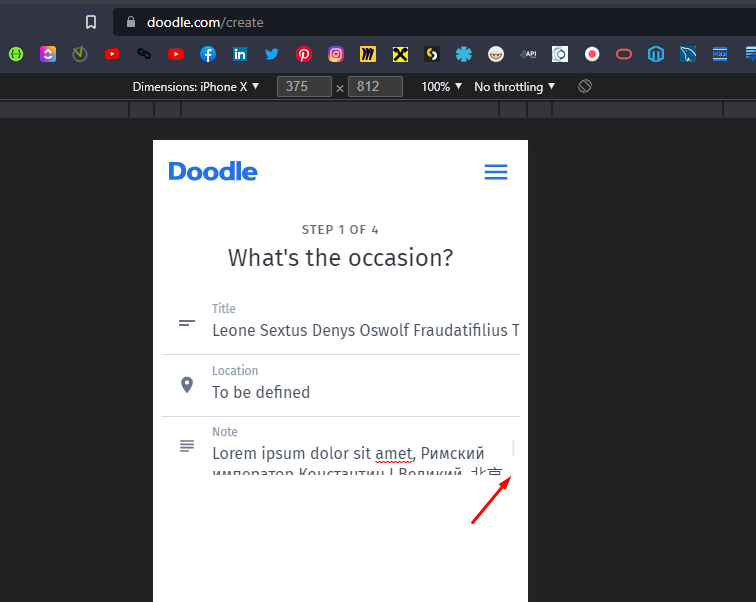
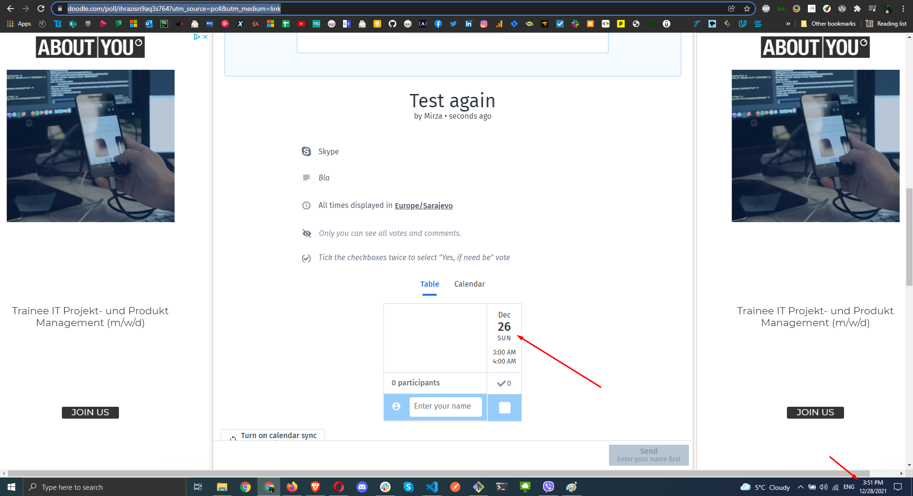

# Explore Doodle.com:

## What, in your opinion, is the main business value functionality?
The functionaliy to create a doodle seems to be the most important one

## How would you approach the quality strategy of a website like doodle.com?

## Did you find any bugs? If yes, write down one of them.
I tried to hack-my-way to enable some premium features, by changing the disabled CSS class to enabled - to hide add, but it didn't work, meaning that the backend validation prevented this, which is good. I found one potential issue (relatiely minor) the Note field, when creating a Doodle (step 1 of 4) has a redundant scroll bar on smaller resolutions:

Also, I was able to create a doodle for December 26th, the date I tried that was December 28th:
[Doodle created 2 days in the past](https://https://doodle.com/poll/ihrazisn9aq3s764?utm_source=poll&utm_medium=link).

## Suggest 3 quality improvements that could be made to doodle.com that you observed.
<ol>
  <li>Further improve accessibility - I found a few issues using the Wave tool - empty headings, buttons with no description and contrast issues</li>
  <li>The performance of the doodle.com is quite good, first contentfull paint takes one second, the speed index is 2.2s I'd see if the number of request can be less than 62 to get the full page interactivity close to 1.3s which is the recommended.</li>
  <li>If possible, suggest using cookie free domains and adding expiring headers, fast performance for the site is becoming increasingly important</li>
</ol>

## Given this UI, how would you design your automation framework using the Page Object Model? Please share a github repo with a basic skeleton test setup. Nothing complicated, just one test case that we could run. For example, you could show us how you would test the functionality of creating and voting on a poll. You are free to create the test run in whatever way you feel is best, but some things we would look for are how you structure your Page Objects, and how you would automate the behaviors and make assertions.
I went with Cypress, the basic UI framework is in the cypress folder.